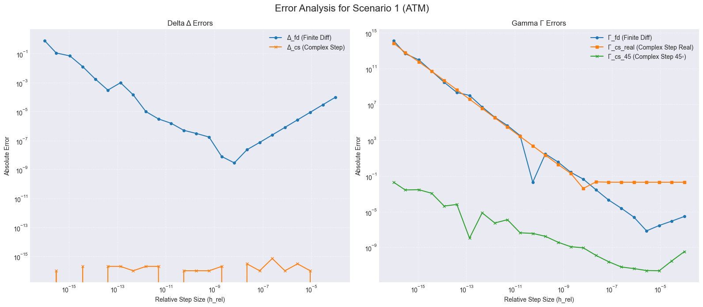
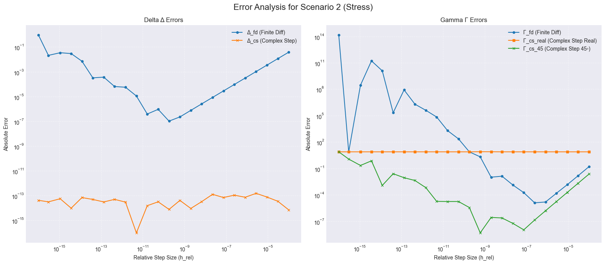

# Black-Scholes Assignment
OP Kiitorata, Qualitative Developer Position<br />
Juuso Rinta<br />
28.10.2025

## How to Build and Run
### Prerequisites
- A C++ compiler
- `make`
- `python3`
- Python libraries: `pandas`, `matplotlib`

You can install the required Python libraries using pip:
```bash
pip install pandas matplotlib
```

### Instructions
1.  **Compile and Run C++ Program:**
    From the project root, run `make`. This will compile the C++ source and run the executable. It generates two `.csv` data files in the `data/` directory.

2.  **Generate Plots:**
    Run the Python script to process the data and generate plots. The plots will also be saved in the `data/` directory.
    ```bash
    python3 plot_errors.py
    ```

# Plots and tables

## Scenario 1



| Method        | Max Error (Worst) | Median Error      | Min Error (Best)  |
|:-------------:|:-----------------:|:-----------------:|:-----------------:|
| err_D_fd      | 7.92e-01          | 6.05e-06          | 2.86e-09          |
| err_D_cs      | 7.00e-16          | 1.00e-16          | 0.00e+00          |
| err_G_fd      | 1.33e+14          | 1.65e+01          | 7.22e-08          |
| err_G_cs_real | 7.11e+13          | 1.29e+02          | 4.02e-03          |
| err_G_cs_45   | 1.98e-02          | 1.43e-08          | 2.48e-12          |

## Scenario 2



| Method        | Max Error (Worst) | Median Error      | Min Error (Best)  |
|:-------------:|:-----------------:|:-----------------:|:-----------------:|
| err_D_fd      | 9.21e-01          | 2.03e-04          | 1.04e-07          |
| err_D_cs      | 1.54e-13          | 3.82e-14          | 1.00e-16          |
| err_G_fd      | 1.42e+14          | 7.63e+00          | 1.24e-05          |
| err_G_cs_real | 7.85e+00          | 7.62e+00          | 7.62e+00          |
| err_G_cs_45   | 7.62e+00          | 1.04e-04          | 4.82e-09          |

# Observations

### Accuracy ranking
- For Delta (Δ): the complex-step method (err_D_cs) is superior. It's median error is almost at machine-level precision, while the finite-difference method is substantially worse.
- For Gamma (Γ): The 45-degree complex-step (err_G_cs_45) is the only viable method. There, too, the U-Shape is quite pronounced but much less than the alternatives. The other two (err_G_fd, err_G_cs_real) are completely unstable.
## Step-size (h) dependency
- Unstable Methods (Δ_fd, Γ_fd, Γ_cs_real): These methods all show a clear U-shaped error curve. The error is high for large $h$ (truncation), high for small $h$ (roundoff), and has a narrow sweet spot in the middle.
- Δ_cs: This method is stable. The error is effectively zero across all step sizes, showing no "U-shape" and no sensitivity to $h$.
- Γ_cs_45: This method shows a much wider and deeper "U-shape." It is accurate for a very broad range of $h$ values. The "sweet spot" is clear, with a minimum error around $h_{rel} ​\approx 10^{-8}$.
### Difference between scenarios
- The stress scenario (2) amplified all the stability issues.
- The unstable Gamma methods (Γ_fd, Γ_cs_real) failed even more spectacularly. In Scenario 2, Γ_cs_real produced no useful data at all.
- The median error for all methods was worse in Scenario 2, demonstrating that the low-vol, low-maturity case is much harder to calculate numerically.
### Stability issues
- The Γ_fd and Γ_cs_real methods produced extreme values for small h due to roundoff error.
- The Γ_cs_45 method also failed at the absolute smallest h, where its error jumped. This is also a type of roundoff error (loss of precision on addition), a stability failure at the machine's limit.
### Program optimization
- I investigated potential performance optimizations for the data generation sweep. I suspected that either redundant calculations or file I/O could be bottlenecks.
- **Attempted Optimizations:**
	- **Caching:** I implemented a version that pre-calculated the base Black-Scholes price and passed it to the Greek calculation functions to avoid redundant calls (where applicable).
	- **I/O Buffering:** I tested buffering all output in a `std::stringstream` and writing to the file in a single operation at the end of the sweep.
- **Results:** Upon benchmarking, the performance difference between the original code and the optimized versions was negligible (total sweep time remained in the 0.7-2ms range).
- **Conclusion:** The current implementation is not bottlenecked by these factors at this scale. For the sake of code clarity and simplicity, I chose to retain the original, more straightforward implementation, as the attempted optimizations added complexity without providing a meaningful performance benefit.

# Brief reasoning
- Truncation Error: Mathematical error from using an approximation. The finite-difference formulas are not exact; they have error terms (e.g., $O(h^2)$). When $h$ is large, this error dominates. This explains the right side of the "U-shaped" curves.
- Roundoff Error: This is the computer error. Methods that require subtracting two numbers that become nearly identical as $h → 0$. A computer loses all its significant digits in this subtraction, and the result is "numerical noise" or garbage. This explains the left side of the "U-shaped" curves, where the error explodes for tiny $h$.
- The complex-step method (Δ_cs) works because its formula avoids subtraction. It has no roundoff error, so its error is just the truncation error, which gets smaller and smaller as h decreases. The Γ_cs_45 method is also designed to avoid this subtraction, which is why it is trillions of times more stable than Γ_fd.

# Recommendation
- For calculating Delta (Δ): Use the complex-step method (Δ_cs). Step size like $h_{rel}$ $10^{-11}$ is good.
- For calculating Gamma (Γ): Use the 45-degree complex-step method (Γ_cs_45).
	- This method is sensitive to h. Based on the data, a relative step size of $10^{-7}$ or $10^{-8}$ seems ideal, as it is at the bottom of the error curve for both scenarios.
